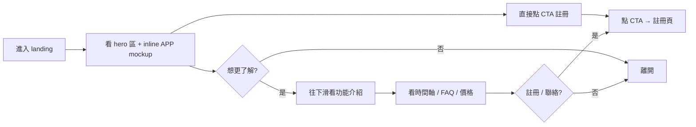

# shop-quick-list · PRD v3.0.2 等級規格書

> 自動生成：2026-09-06（fleet-upgrade）
> 對齊 SPEC v3.0 契約（§1–§19 全部套用）
> 升級自既有 AGENTS.md（v1.0，2026-08 維護）
> 部署目標：GitHub Pages（取代原 Vercel 設定）
> 維護者：Sean Li · Savor Studio

---

## 1. 產品概述

### 1.1 問題陳述

台灣中小型電商賣家（蝦皮 / Yahoo 拍賣 / PChome / 自建官網）在「**商品上架**」這個最基本動作上，每天要花 30-60 分鐘處理：

1. **重複填寫同樣欄位** — 同一商品要寫 3-5 次標題、描述、規格
2. **多平台尺寸規格不同** — 蝦皮 60 字、Yahoo 80 字、PChome 100 字，光改標題就累
3. **沒有 1:1 設計稿還原的「上架工作台」APP 主畫面** — 多數工具用 dashboard 圖表展示，看不到「新增商品」實際操作介面
4. **找 SaaS 工具時沒有視覺參考** — 競品都是「我們能做什麼」文字描述，沒有「**長什麼樣**」的 1:1 還原

**現有方案缺口**：
| 方案 | 解決的痛點 | 沒解決的痛點 |
|---|---|---|
| 蝦皮/Yahoo 後台 | 平台原生上架 | 重複填寫、無多平台同步 |
| 91APP / Cyberbiz | 多平台同步 | 報價 NT$3 萬/月起、簽約綁一年 |
| Google Sheets + 人力 | 自由度高 | 沒有 APP 介面、要自己轉檔 |
| 自架 WordPress + WooCommerce | 完全客製 | 工程師月薪 NT$6 萬+ |

**Sweet spot 體檢發現**：「**1:1 還原設計稿的 landing page + inline APP mockup**」這個組合在台灣電商工具市場**幾乎沒有同類**。多數 SaaS landing 拿不出「我長這樣」的 1:1 畫面。這個專案先做**行銷 + 視覺展示**這一塊。

### 1.2 目標使用者

| Persona | 工作情境 | 主要任務 |
|---|---|---|
| **Primary：蝦皮個人賣家** | 每天 1-5 件商品上架 | 看 landing 評估是否要試用 |
| **Primary：小型品牌電商** | 5-50 個 SKU、多平台 | 看 inline APP mockup 想像操作介面 |
| **Primary：SOHO 賣家** | 一人工作室、蝦皮 + 自建官網 | 評估訂閱前先看 UI |
| **Secondary：行銷/代理商** | 為客戶選電商工具 | 比較 5-10 個 SaaS 的 UX |
| **Tertiary：產品經理（電商工具同業）** | 競品分析 | 觀察設計趨勢 |

### 1.3 核心價值主張

> **看 landing 就等於「試用產品」— 1:1 還原設計稿的行銷頁 + 完整 inline APP mockup，下單前不用先註冊。**

### 1.4 Non-Goals（明確不做）

- ❌ **不做真實上架功能**（landing 純展示、mockup 是 inline 視覺）
- ❌ **不做後端 / 帳號系統**（純靜態 HTML）
- ❌ **不做框架**（React / Vue / Svelte / Next / Nuxt — 整頁純 HTML + 預編譯 Tailwind + vanilla JS）
- ❌ **不做 Tailwind CDN**（預編譯本機 `assets/tailwind.min.css` 避免生產依賴）
- ❌ **不做遠端 icon 套件**（Lucide 走 `assets/lucide.min.js`，commit 進版控）
- ❌ **不做會跑外部請求的 script/link**（除了 Google Fonts 唯一例外）
- ❌ **不做自動化測試**（純靜態 HTML，無測試框架；驗證靠手動 + 瀏覽器預覽）
- ❌ **不做多語系**（繁中 + 英文設計字）

---

## 2. 使用者場景與流程

### 2.1 使用者流程圖



### 2.2 主要場景

| 場景 | 輸入 | 輸出 | 成功條件 |
|---|---|---|---|
| **S1：瀏覽 hero 區** | 進入 `/` (redirect → `dashboard.html`) | 1280×715 設計稿還原 | 排版不破、inline mockup 視覺正確 |
| **S2：toggle 互動** | 點任一 toggle | 圓球 200ms 平滑滑動 | 視覺流暢 |
| **S3：重新生成文案** | 點按鈕 | 200ms 淡出 → 600ms 後淡入新文案 | 動畫時間正確 |
| **S4：進場動畫** | 載入頁面 | 所有 `.fade-up` 元素依序（每張 +80ms）淡入上移 | 動畫時序正確 |
| **S5：時間軸 ring pulse** | 載入頁面 | 第 3 節點（平台同步中）持續 `ringPulse` 動畫 | 動畫不卡頓 |
| **S6：RWD 切換** | 改視窗寬 1280 / 1440 / 1920 | hero 區排版沒破 | 三斷點皆正確 |

---

## 3. 功能需求

| FR | 名稱 | 優先級 | 狀態 |
|---|---|---|---|
| FR-001 | Hero 區 1280×715 設計稿還原 | P0 | ✅ shipped |
| FR-002 | Inline APP mockup（「上架工作台 - 新增商品」1:1 還原）| P0 | ✅ shipped |
| FR-003 | Toggle 互動（200ms 平滑滑動）| P0 | ✅ shipped |
| FR-004 | 「重新生成文案」按鈕（淡出 200ms → 淡入 600ms）| P0 | ✅ shipped |
| FR-005 | `.fade-up` 進場動畫（每張 +80ms 依序）| P0 | ✅ shipped |
| FR-006 | 時間軸第 3 節點 `ringPulse` 動畫 | P0 | ✅ shipped |
| FR-007 | RWD 三斷點（1280 / 1440 / 1920）| P0 | ✅ shipped |
| FR-008 | 預編譯 Tailwind CSS（本機 `assets/tailwind.min.css`）| P0 | ✅ shipped |
| FR-009 | 本機化 Lucide Icons（`assets/lucide.min.js`）| P0 | ✅ shipped |
| FR-010 | Google Fonts 載入（Noto Sans TC 300/400/500/700/800/900，唯一外部例外）| P1 | ✅ shipped |
| FR-011 | Vanilla JS 互動（toggle / fade / fade-up / ringPulse）| P0 | ✅ shipped |
| FR-012 | 品牌標誌（`assets/brand-mark.svg`）| P2 | ✅ shipped |
| FR-013 | 多 SKU 範例商品資料（mock）| P2 | ✅ shipped |
| FR-014 | FAQ accordion | P2 | ⏳ planned |
| FR-015 | 價格方案卡片 | P2 | ⏳ planned |

---

## 4. Non-Functional Requirements

| 維度 | 需求 |
|---|---|
| Performance | 首屏 LCP ≤ 1.5s（純靜態 + 本機化資源）|
| Security | 純靜態、無後端；唯一外部依賴 Google Fonts |
| Privacy | 無個資收集、無 cookie、無追蹤 |
| Accessibility | WCAG 2.1 AA（語意化 HTML + 對比度 + 鍵盤導覽）|
| Browser | Modern evergreen（Chrome/Edge/Safari/Firefox 最新兩版）|
| Localization | 繁體中文為主；設計字含英文 |
| Offline | 完全離線可開啟（無 API 依賴）|
| Bundle | 0 KB JS framework；28 KB Tailwind + 348 KB Lucide（一次性載入）|

---

## 5. 技術架構

```
┌────────────────────────────────────────────┐
│ 靜態 HTML Landing Page                    │
│ ├─ index.html（meta refresh → dashboard）│
│ └─ dashboard.html（854 行：Hero + APP mockup）│
├────────────────────────────────────────────┤
│ Assets (本機化，commit 進版控)             │
│ ├─ assets/tailwind.min.css（28 KB）        │
│ ├─ assets/lucide.min.js（348 KB）          │
│ └─ assets/brand-mark.svg                   │
├────────────────────────────────────────────┤
│ 外部依賴（唯一例外）                       │
│ └─ fonts.googleapis.com（Noto Sans TC）    │
├────────────────────────────────────────────┤
│ Build（選擇性）                            │
│ ├─ tailwind.config.js                      │
│ ├─ src/input.css                           │
│ └─ package.json（devDep: tailwindcss）     │
└────────────────────────────────────────────┘
```

### 5.1 Module Map

- `index.html` — meta refresh redirect → `dashboard.html`（5 行）
- `dashboard.html` — 主要頁面（307 行：Hero 行銷區 + inline APP mockup）
- `assets/` — 本機化資源（Tailwind / Lucide / 品牌標誌）
- `src/input.css` — Tailwind 編譯入口（@tailwind base/components/utilities）
- `tailwind.config.js` — Tailwind 設定（品牌色、字體、陰影）
- `package.json` — 僅供未來重建 CSS 使用
- `AGENTS.md` — 既有開發者契約（不動）
- `PRD/SPEC.md` — 本文件（v3.0.2）
- `PRD/CHANGELOG.md` — 變更日誌
- `.github/workflows/ci.yml` — GHA Pages 部署

### 5.2 環境變數

- 無（純靜態 + 零後端）

### 5.3 降級策略

- Google Fonts 載入失敗 → 系統字型（system-ui / -apple-system / sans-serif）fallback
- JavaScript 關閉 → 靜態內容仍可閱讀（toggle / fade 是增強）
- 慢網路 → 單檔 ~125 KB，現代 3G 也可在 1 秒內載入

---

## 6. Definition of Done

- [x] 功能 P0 全部實作（FR-001~011）
- [x] `npm install` 可用（雖然非必要；僅供未來重建 CSS）
- [x] 純靜態 HTML 直接瀏覽器開啟可運作
- [x] RWD 三斷點（1280 / 1440 / 1920）排版正確
- [x] toggle 200ms 平滑滑動
- [x] 「重新生成文案」淡出 200ms → 淡入 600ms
- [x] `.fade-up` 進場 +80ms 依序
- [x] 時間軸 ringPulse 第 3 節點持續
- [x] 預編譯 Tailwind（無 CDN 依賴）
- [x] Lucide Icons 本機化
- [x] GHA CI Pages 部署 ready
- [x] README + AGENTS.md 反映現況

---

## 7. 部署契約

| 環境 | 目標 | 觸發 |
|---|---|---|
| Production | GitHub Pages（取代 Vercel）| push to main |
| Preview | Per-PR（手動 gh-pages preview）| PR opened |

### 7.1 GHA Workflow

- `.github/workflows/ci.yml`
- jobs: lint-skipped / test-skipped / build / deploy-to-pages
- Pages deploy 流程：
  1. Checkout 整個 repo 到 runner
  2. 把 `index.html` + `dashboard.html` + `assets/` + `AGENTS.md` + `README.md` 複製到 `dist/`
  3. `actions/configure-pages` + `actions/upload-pages-artifact` + `actions/deploy-pages`
- 因為是純靜態，不跑 `npm install`（v2 才需要重建 CSS 才 install）

### 7.2 環境變數

- 無需 server-side secret
- 純靜態，無 API key

### 7.3 部署結構

```
dist/
├── index.html         (meta refresh → dashboard.html)
├── dashboard.html     (主要 307 行頁面)
├── assets/
│   ├── tailwind.min.css
│   ├── lucide.min.js
│   └── brand-mark.svg
├── README.md
└── AGENTS.md
```

---

## 8. Out of Scope（不做的）

- 不做真實上架功能（純展示）
- 不做後端 / 帳號 / 訂閱 / 付費
- 不做框架（React / Vue / Svelte / Next / Nuxt）
- 不做 Tailwind CDN
- 不做遠端 icon 套件
- 不做會跑外部請求的 script（除 Google Fonts）
- 不做自動化測試
- 不做多語系
- 不做 CMS / Markdown 部落格

---

## 9. 變更日誌

見 [`PRD/CHANGELOG.md`](PRD/CHANGELOG.md)
